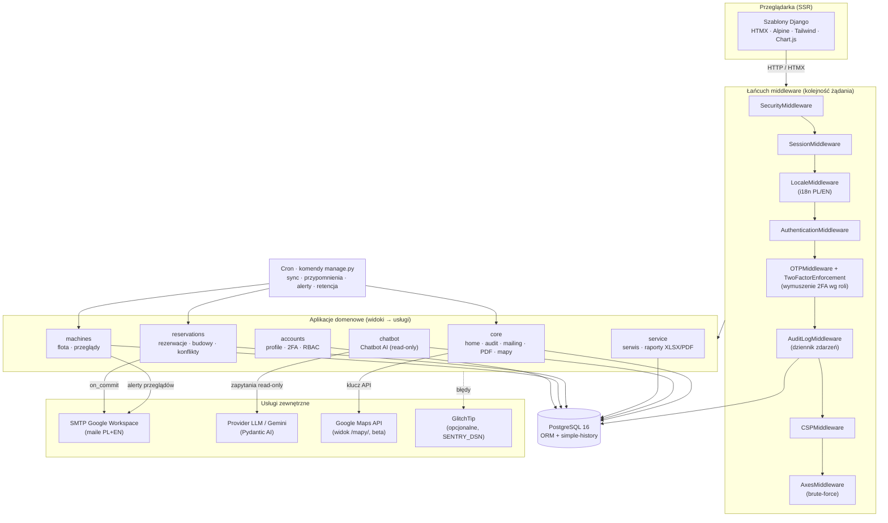
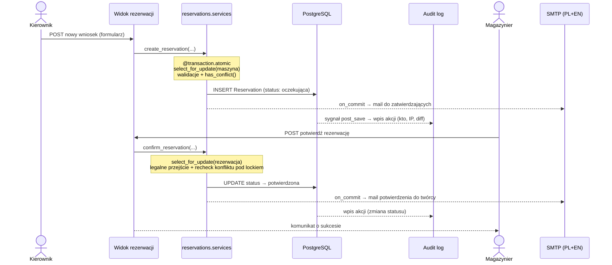

# Architektura aplikacji

Przegląd architektury Planera Maszyn Budowlanych — warstwy, aplikacje Django,
łańcuch middleware, kontrola dostępu (RBAC) oraz przepływ danych dla kluczowej
operacji. Diagram renderuje się bezpośrednio na GitHub (Mermaid).

Model danych (encje i relacje) opisany jest osobno w
[`docs/erd.md`](erd.md); decyzje architektoniczne w katalogu
[`docs/adr/`](adr/).

## Warstwy

Aplikacja jest klasycznym, renderowanym po stronie serwera (SSR) monolitem
Django 5.2 LTS, podzielonym na luźno powiązane aplikacje domenowe.

| Warstwa | Co zawiera | Technologie |
|---------|------------|-------------|
| **Przeglądarka** | Szablony HTML renderowane na serwerze, wzbogacone o interaktywność bez przeładowania strony i lekki stan po stronie klienta. | Django Templates, HTMX 2, Alpine.js 3, Tailwind CSS 3, Flatpickr, Chart.js — wszystko vendorowane w `static/vendor/` (zero CDN, działa offline na intranecie). |
| **Middleware** | Łańcuch przetwarzania każdego żądania: bezpieczeństwo, sesja, język (i18n), uwierzytelnianie, wymuszenie 2FA, dziennik zdarzeń, CSP, rate-limit. | Middleware Django + `django-otp`, `django-csp`, `django-axes`, `django-htmx`, `django-simple-history` oraz dwa własne middleware (2FA, audit log). |
| **Widoki i formularze** | Routing per aplikacja (`urls.py`), widoki obsługujące żądania, formularze walidujące dane wejściowe. Widoki **nie** mutują stanu bezpośrednio. | Django views, Django Forms (`widget_tweaks` do klas CSS). |
| **Warstwa usług (services)** | Jedyne miejsce mutacji stanu domenowego. Każda operacja w `@transaction.atomic`, walidacje biznesowe i maszyna stanów w jednym miejscu. | `*/services.py`, `*/selectors.py` (odczyt), `*/managers.py` (querysety). |
| **ORM i baza danych** | Modele domenowe, migracje, querysety, blokady wierszy (`select_for_update`). | Django ORM, PostgreSQL 16, `django-money` (koszty), `django-simple-history` (historia pól). |
| **Warstwa mailingu** | Dwujęzyczne (PL+EN) maile transakcyjne wysyłane przez `transaction.on_commit` (rollback transakcji = brak maila). | `core/mailing.py`, `*/emails.py`, SMTP Google Workspace. |
| **Asystent (Chatbot AI)** | Konwersacyjny moduł zapytań o flotę. Narzędzia agenta są **wyłącznie odczytujące**; akcje zapisujące wymagają jawnego potwierdzenia użytkownika. | `chatbot/` — Pydantic AI + provider LLM (Gemini). |
| **Zadania cykliczne** | Komendy `manage.py` uruchamiane przez cron: synchronizacja statusów, przypomnienia, alerty przeglądów, retencja dziennika. | `*/management/commands/`. |
| **Obserwowalność (opcjonalna)** | Raportowanie błędów do self-hosted GlitchTip — aktywne tylko gdy ustawiony `SENTRY_DSN`. | Sentry SDK → GlitchTip. |

Internacjonalizacja obejmuje całą aplikację: język domyślny to polski
(klucze `gettext_lazy` pisane po polsku), katalog `locale/en/` dostarcza
tłumaczenia EN. Wybór języka jest per-użytkownik (cookie `django_language` +
sesja, fallback na `Accept-Language`), a format daty jest wymuszony europejski
(`dd.mm.yyyy`) niezależnie od języka przez `FORMAT_MODULE_PATH`.

## Diagram komponentów

## Łańcuch middleware

Kolejność middleware (z `planer_config/settings/base.py`) jest istotna — każde
ogniwo zakłada, że poprzednie już się wykonało. Najważniejsze pozycje:

1. **`SecurityMiddleware`** — nagłówki bezpieczeństwa (HSTS, redirecty HTTPS w prod).
2. **`SessionMiddleware`** — wczytuje sesję (potrzebna dla języka i logowania).
3. **`LocaleMiddleware`** — ustala aktywny język (PL/EN) z cookie/sesji/nagłówka.
   Musi być **po** sesji, a **przed** `CommonMiddleware` (wpływa na rozwiązywanie URL).
4. **`CommonMiddleware`**, **`CsrfViewMiddleware`** — normalizacja URL, ochrona CSRF.
5. **`AuthenticationMiddleware`** — dołącza `request.user`.
6. **`OTPMiddleware`** (`django-otp`) — udostępnia `request.user.is_verified()` (status 2FA).
7. **`TwoFactorEnforcementMiddleware`** (`accounts/middleware.py`) — własne wymuszenie
   2FA: zalogowany użytkownik z rolą wymagającą TOTP (administrator / kierownik /
   magazynier), który nie przeszedł drugiego składnika, jest przekierowywany na
   weryfikację lub konfigurację 2FA. Ścieżki wyjęte spod wymogu (login, sam setup
   2FA, statyki, healthcheck, i18n) są na liście dozwolonych. Montażyści są zwolnieni.
   Flaga `OTP_ENFORCE_2FA` pozwala wyłączyć wymuszenie w dev; testy omijają je
   przez `OTP_TESTING_BYPASS`.
8. **`AuditLogMiddleware`** (`core/middleware.py`) — dziennik zdarzeń. Dla każdego
   udanego (2xx/3xx) żądania mutującego (POST/PUT/PATCH/DELETE) zapisuje wpis(y)
   do `AuditLogEntry`: kto, jaka akcja (nazwa widoku), IP (`X-Forwarded-For`),
   user-agent. Sygnały z `core/audit.py` dostarczają diff zmienionych pól dla
   śledzonych modeli; akcje bez zmiany modelu (logowanie, eksport) tworzą pojedynczy
   wpis-akcję. Zapis audytu nigdy nie wywraca żądania (obronne `try/except`).
9. **`MessageMiddleware`**, **`XFrameOptionsMiddleware`** — komunikaty flash, anty-clickjacking.
10. **`CSPMiddleware`** (`django-csp`) — nagłówki Content Security Policy (+ nonce).
11. **`HtmxMiddleware`** (`django-htmx`) — flaga `request.htmx` dla widoków zwracających fragmenty.
12. **`HistoryRequestMiddleware`** (`django-simple-history`) — przypina autora zmian do historii pól.
13. **`RatelimitedMiddleware`** (`chatbot/middleware.py`) — zamienia przekroczenie
    limitu zapytań na czytelny komunikat 429.
14. **`AxesMiddleware`** (`django-axes`) — ochrona przed brute-force; musi być **ostatnia**.

## Kontrola dostępu (RBAC)

Uprawnienia opierają się na czterech rolach. Funkcja konta (`EmployeeProfile.function`)
napędza zarówno przynależność do grup, jak i wymóg 2FA. Trzy grupy są tworzone
deterministycznie przez migrację `accounts.0003_create_rbac_groups`; czwarta rola
(montażysta) jest stanem domyślnym bez grupy uprawnień zapisujących.

| Rola | Grupa Django | Uprawnienia (wysoki poziom) | 2FA |
|------|--------------|-----------------------------|-----|
| **Administratorzy** | `Administratorzy` | Pełen dostęp do wszystkich aplikacji domenowych (maszyny, rezerwacje, serwis, profile) — komplet uprawnień add/change/delete/view. Adresaci alertów przeglądowych. | Wymagane |
| **Magazynierzy** | `Magazynierzy` | Zarządzanie rezerwacjami (tworzenie / edycja / usuwanie / **potwierdzanie**) i budowami; podgląd i edycja maszyn; tworzenie i edycja wpisów serwisowych. To oni zatwierdzają wnioski o rezerwację. | Wymagane |
| **Kierownicy** | `Kierownicy` | Składanie i edycja **wniosków** o rezerwację oraz zarządzanie budowami; podgląd maszyn; dodawanie wpisów serwisowych. Bez uprawnienia do potwierdzania/usuwania rezerwacji (wniosek zatwierdza magazynier/admin). | Wymagane |
| **Montażyści** | — (brak grupy) | Dostęp tylko do odczytu; nie widzą kosztów serwisowych. Rola domyślna. | Zwolnieni |

Egzekwowanie odbywa się standardowymi mechanizmami Django (`@login_required`,
`permission_required`, sprawdzanie `user.has_perm(...)`), uzupełnionymi o
defense-in-depth w warstwie usług — np. mail z wnioskiem o rezerwację trafia
wyłącznie do użytkowników z uprawnieniem `reservations.change_reservation`.
Szczegóły decyzji: [`adr/001-rbac-groups-and-created-by.md`](adr/001-rbac-groups-and-created-by.md),
[`adr/003-2fa-totp-enforcement.md`](adr/003-2fa-totp-enforcement.md).

## Przepływ danych — utworzenie i potwierdzenie rezerwacji

Przykład ścieżki żądania end-to-end, łączący widok, warstwę usług, blokady,
mailing i dziennik zdarzeń.

Kluczowe gwarancje tego przepływu:

- **Atomowość i brak wyścigów** — `create_reservation` i `confirm_reservation`
  działają w `@transaction.atomic` i blokują wiersz maszyny/rezerwacji przez
  `select_for_update`. Konflikt terminów jest sprawdzany ponownie *pod blokadą*
  przy potwierdzaniu (dwóch zatwierdzających nie potwierdzi nakładających się rezerwacji).
- **Maile po commicie** — wysyłka jest kolejkowana przez `transaction.on_commit`,
  więc rollback transakcji oznacza zero maili. Każdy mail jest dwujęzyczny (PL+EN
  w jednej wiadomości), a potwierdzenie jest idempotentne (guard `confirmation_email_queued_at`).
- **Dziennik zdarzeń** — `AuditLogMiddleware` po udanym żądaniu mutującym zapisuje
  wpis(y) `AuditLogEntry` z diffem pól dostarczonym przez sygnały `core/audit.py`.
- **Maszyna stanów** — legalne przejścia statusów (`oczekująca → potwierdzona →
  zakończona`, plus `anulowana`) wymusza `RESERVATION_TRANSITIONS`; zakończenie
  rezerwacji zwraca maszynę do magazynu (Hard Return Policy).

## Powiązane dokumenty

- [`docs/erd.md`](erd.md) — model danych (encje i relacje).
- [`docs/adr/`](adr/) — rejestr decyzji architektonicznych (RBAC, MoneyField,
  2FA, GlitchTip, tożsamość po caller-ID, warstwa akcji dziennika zdarzeń).
- [`README.md`](../README.md) — przegląd funkcjonalności, stack i uruchomienie.
