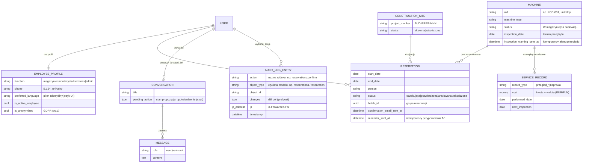

# Diagram ERD — model danych

Diagram encji i relacji głównych modeli domenowych aplikacji. Renderuje się
bezpośrednio na GitHub (Mermaid).

## Kluczowe relacje i decyzje

- **`Reservation.created_by → User`** — autor rezerwacji (adresat e-maila
  potwierdzającego, podstawa widoczności w edycji). Patrz ADR-001.
- **`ServiceRecord.cost`** to `MoneyField` (kwota + waluta). Patrz ADR-002.
- **`EmployeeProfile.function`** napędza grupy RBAC (migracja
  `accounts.0003_create_rbac_groups`) oraz wymóg 2FA. Patrz ADR-001, ADR-003.
- **Klucze obce** maszyn i budów są `PROTECT` — rekord nadrzędny nie znika, gdy
  istnieją powiązane rezerwacje/wpisy serwisowe.
- **Audyt — dwie warstwy:** `django-simple-history` trzyma pełną historię PÓL
  każdego modelu (tabele historyczne, pominięte na diagramie), a
  `AuditLogEntry` rejestruje AKCJE użytkownika (które żądanie POST/PUT/PATCH/
  DELETE, kto, IP, na czym) — także zdarzenia bez zmiany modelu (logowanie,
  eksport). Patrz ADR-008.
